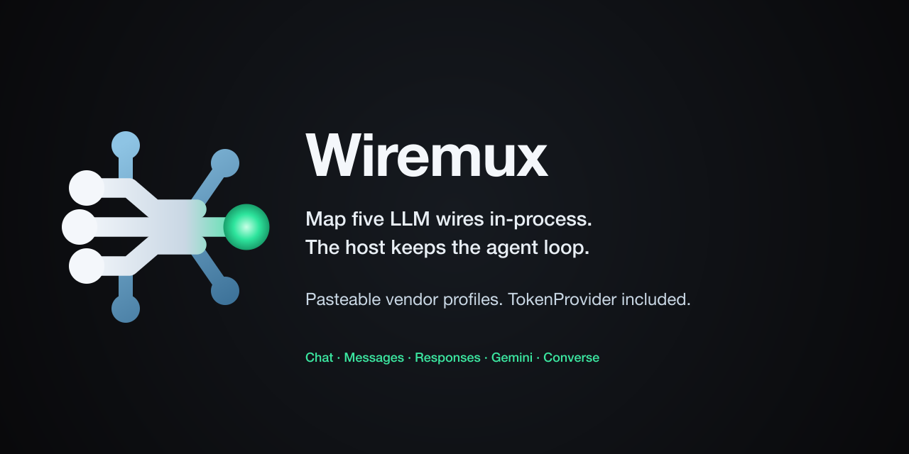

# Wiremux



[](https://github.com/wiremuxhq/wiremux/actions/workflows/ci.yml?query=event%3Apull_request)
[](https://github.com/wiremuxhq/wiremux/actions/workflows/security.yml?query=event%3Apush)
[](https://crates.io/crates/wiremux)
[](https://docs.rs/wiremux)
[](https://github.com/wiremuxhq/wiremux/releases/latest)

[](https://github.com/wiremuxhq/wiremux/blob/main/LICENSE)
[](https://securityscorecards.dev/viewer/?uri=github.com/wiremuxhq/wiremux)
[](https://www.bestpractices.dev/projects/15097)
[](https://github.com/wiremuxhq/wiremux/actions/workflows/fossa.yml?query=event%3Apush)
[](https://crates.io/crates/wiremux-auth)

Map Chat Completions, Messages, Responses, Gemini, and Converse
through one in-process IR. Refresh tokens from the same pasteable
vendor profiles. The host keeps the agent loop.

## Crates

| Crate | Job |
| --- | --- |
| [`wiremux`](https://crates.io/crates/wiremux) ([docs](https://docs.rs/wiremux)) | Dialect maps (`decode` / `encode` / stream) plus optional CLI and loopback proxy |
| [`wiremux-auth`](https://crates.io/crates/wiremux-auth) ([docs](https://docs.rs/wiremux-auth)) | Profile catalog and `TokenProvider` (static, OAuth, GCP, Azure, AWS) |

Maps-only hosts depend on `wiremux` with `default-features = false`.
That path does not pull clap, tokio, reqwest, or aws-lc.

This repository may be ahead of crates.io. Host attach notes in
[`docs/CONSUME.md`](docs/CONSUME.md) pin the published cut.

## Install

MSRV is 1.95 (see `rust-toolchain.toml`).

```bash
cargo add wiremux --no-default-features
cargo add wiremux-auth
```

CLI and proxy:

```bash
cargo install wiremux --locked
```

Maps-only hosts stop after the first command. TokenProvider hosts
also add `wiremux-auth`.

## Maps

Decode a vendor JSON body into `IrRequest`, then encode another wire.
The profile supplies vendor quirks. Encode-side loss is typed
(`preserve` / `degrade` / `drop` / `hard-error`).
`--dump-loss` prints one line per change:

```text
loss.encode: degrade sampling.max_tokens: messages requires max_tokens
```

```rust
use wiremux::{LoadOptions, Wire, decode, encode, load_profile_for_wire};

let src = br#"{"model":"gpt-4o","messages":[{"role":"user","content":"ping"}]}"#;
let (ir, _loss) = decode(Wire::ChatCompletions, src).unwrap();
let profile = load_profile_for_wire(
    Wire::Messages,
    &LoadOptions {
        include_shipped: false,
        include_user_config: false,
        ..LoadOptions::default()
    },
)
.unwrap();
let (_out, _loss) = encode(Wire::Messages, &ir, &profile).unwrap();
```

Run the same program from this tree:

```bash
cargo run -p wiremux --example remap --no-default-features
```

The CLI prints the encoded body on stdout. Loss lines go to stderr:

```bash
wiremux map --from chat --to messages request.json
```

Wires: `chat-completions` (CLI also accepts `chat`), `messages`,
`responses`, `gemini`, `converse`. Profile TOML uses
`wire = "chat-completions"`, not `wire = "chat"`.

## Auth and profiles

Shipped vendors are ordinary TOML. A gist uses the same schema, so a
rotated token URL, client id, or beta header does not need a crate
release. Profiles are data: no functions, no `!command`, no
URL-as-script. `$VAR` / `${VAR}` / `{env:VAR}` are allowed.

```bash
wiremux profile list
wiremux profile validate openai
wiremux auth status openai
```

`wiremux auth login` follows the profile `login` engine. Several
shipped OAuth files use `login = "none"` until a public Wiremux
client id exists; those exit 2 with a setup hint.

Catalog ingest writes user-dir profiles from
[models.dev](https://models.dev/api.json) (default) or LiteLLM
(`--source litellm`). Catalog misses fail closed.

## Proxy

Loopback only (`127.0.0.1`). Incoming harness dialect is `--from`.
Upstream comes from `--profile`.

```bash
wiremux proxy --from chat-completions --profile ollama --dump-loss
```

`--dump-loss` prints a `LossReport` on stderr per request.

## Host attach

How a host application should pin, wrap `TokenProvider`, and map at
the adapter boundary: [`docs/CONSUME.md`](docs/CONSUME.md).

Architecture (IR, loss, what stays in the host):
[`docs/ARCHITECTURE.md`](docs/ARCHITECTURE.md).

Copy-paste examples: [`examples/`](examples/).

## Status

0.x. Public IR and error enums are `#[non_exhaustive]`. Dual license
[MIT](LICENSE) OR [Apache-2.0](LICENSE-APACHE).

This crate is not a LiteLLM clone, not a desktop switcher, and not a
subscription pool. It does not ship a public Claude-Pro-in-Codex,
Cline, or OpenCode preset.

## Contributing

See [`CONTRIBUTING.md`](CONTRIBUTING.md). `make check` is the local
gate. Commits need `git commit -s` (DCO). Questions:
[`SUPPORT.md`](SUPPORT.md). Maintainer rules:
[`GOVERNANCE.md`](GOVERNANCE.md).

Security reports go to [`SECURITY.md`](SECURITY.md), not a public
issue.
